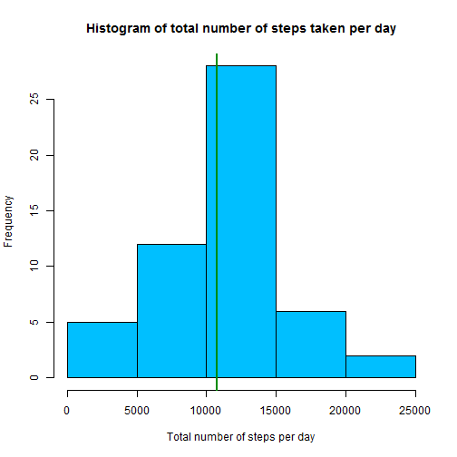
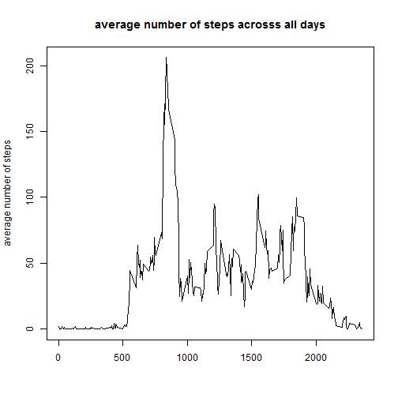
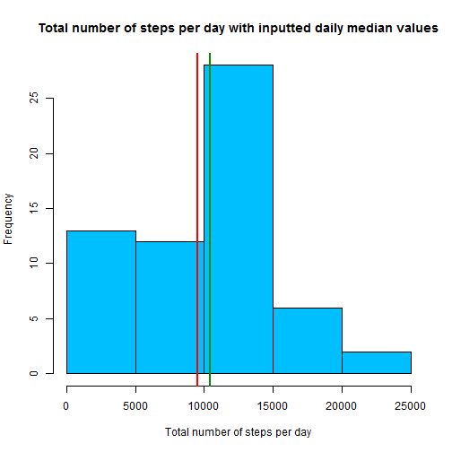
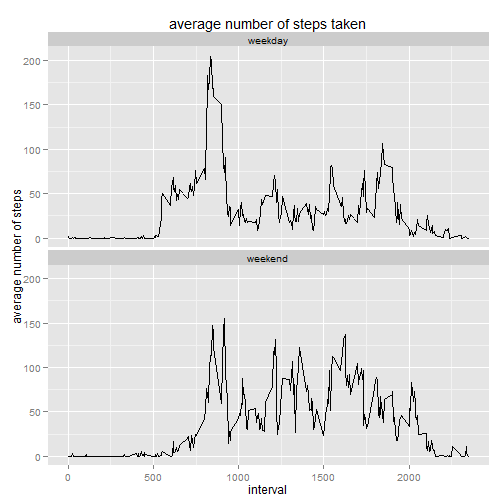

# Peer_Assessment_1_Coursera_Reproducible_Research

  author: Micha Bouts

  date: Tuesday, August 4th, 2015


### Description of working environment


```r
sessionInfo()
```

```
## R version 3.1.2 (2014-10-31)
## Platform: x86_64-w64-mingw32/x64 (64-bit)
## 
## locale:
## [1] LC_COLLATE=English_United States.1252 
## [2] LC_CTYPE=English_United States.1252   
## [3] LC_MONETARY=English_United States.1252
## [4] LC_NUMERIC=C                          
## [5] LC_TIME=English_United States.1252    
## 
## attached base packages:
## [1] stats     graphics  grDevices utils     datasets  methods   base     
## 
## other attached packages:
## [1] ggplot2_1.0.0 dplyr_0.4.1   knitr_1.7    
## 
## loaded via a namespace (and not attached):
##  [1] assertthat_0.1   colorspace_1.2-4 DBI_0.3.1        digest_0.6.4    
##  [5] evaluate_0.5.5   formatR_1.0      grid_3.1.2       gtable_0.1.2    
##  [9] htmltools_0.2.6  labeling_0.3     lazyeval_0.1.10  magrittr_1.5    
## [13] markdown_0.7.4   MASS_7.3-35      mime_0.2         munsell_0.4.2   
## [17] parallel_3.1.2   plyr_1.8.1       proto_0.3-10     Rcpp_0.11.5     
## [21] reshape2_1.4     rmarkdown_0.3.10 scales_0.2.4     stringr_0.6.2   
## [25] tools_3.1.2      yaml_2.1.13
```

```r
setwd("~/R/Coursera/Reproducible_Research/Project_1")

library(knitr)
library(dplyr)
```


### Loading and preprocessing the data


```r
if (!file.exists("data")) {dir.create("data")}

unzip("C:/Users/Eigenaar/Repositories/RepData_PeerAssessment1/activity.zip", exdir = "./data")

## Load the data

df <- read.csv("./data/activity.csv")

## Process/transform the data

df <- select(df, date, interval, steps)
```

From October 1st 2012 until November 30th 2012 every hour of the day the number of steps are measured.
This measurement is sampled in a 5 minute interval, which is 12 times per hour, 12 x 24 = 288 times per day 
and 288 x (31 + 30) = 17568 times during these two months.  


## What is the mean total number of steps taken per day?


```r
## group per date, remove NA's and calculate the total number of steps taken per day

stepsDay <- df %>%
                group_by(date) %>%
                filter(!is.na(steps)) %>%
                summarize(steps_per_day = sum(steps))

stepsDay
```

```
## Source: local data frame [53 x 2]
## 
##          date steps_per_day
## 1  2012-10-02           126
## 2  2012-10-03         11352
## 3  2012-10-04         12116
## 4  2012-10-05         13294
## 5  2012-10-06         15420
## 6  2012-10-07         11015
## 7  2012-10-09         12811
## 8  2012-10-10          9900
## 9  2012-10-11         10304
## 10 2012-10-12         17382
## ..        ...           ...
```

```r
## plot a histogram of the total number of steps taken per day

hist(stepsDay$steps_per_day, 
     
     col = "deepskyblue",
     main = "histogram of total number of steps taken per day",
     xlab = "total number of steps per day"
     )

## superimpose two vertical lines on the histogram, representing the mean and median of steps taken per day

abline(v = mean(stepsDay$steps_per_day), lwd = 2, col = "red")
abline(v = median(stepsDay$steps_per_day), lwd = 2, col = "green4")
```

 

```r
## calculate and report the mean and median of the total number of steps taken per day

summary(stepsDay$steps_per_day)
```

```
##    Min. 1st Qu.  Median    Mean 3rd Qu.    Max. 
##      41    8841   10760   10770   13290   21190
```

Remark 

- The mean and median differ only a small number of steps.Therefore their graphical presentation is visualized by the same vertical line.


## What is the average daily activity pattern?


```r
## Create a time series plot of the 5-minute interval (x-axis) 
## and the average number of steps, across all days.

# Create a dataframe with the average number of steps.

averageSteps <- df %>%
                        group_by(interval) %>%
                        filter(!is.na(steps)) %>%
                        summarize(average_steps = mean(steps))
        
averageSteps
```

```
## Source: local data frame [288 x 2]
## 
##    interval average_steps
## 1         0     1.7169811
## 2         5     0.3396226
## 3        10     0.1320755
## 4        15     0.1509434
## 5        20     0.0754717
## 6        25     2.0943396
## 7        30     0.5283019
## 8        35     0.8679245
## 9        40     0.0000000
## 10       45     1.4716981
## ..      ...           ...
```

```r
# Plot the average number of steps across all days.

with(averageSteps, 

        plot(interval, average_steps, 
                
                type = "l", 
                xlab = "", 
                ylab = "average number of steps",
                main = "average number of steps acrosss all days")
        )
```

 

```r
## Calculate and report the 5-minute interval that contains on average across
## all days the maximum number of steps.

(filter(averageSteps, average_steps == max(average_steps)))
```

```
## Source: local data frame [1 x 2]
## 
##   interval average_steps
## 1      835      206.1698
```

```r
maxInterval <- filter(averageSteps, average_steps == max(average_steps))
reportInterval <- maxInterval[1,1]                      
```

Interval 835 is the 5-minute interval with the maximum number of steps across all days.


## Imputing missing values

There are 2304 rows with missing values for the step-variable. We fill the NA of a time interval with the median value of the non-NA's for this specific time-interval. Using the median rather than the mean filters out the influence of extreme values.


```r
## Calculate and report the total number of missing values in the dataset.

colSums(is.na(df))
```

```
##     date interval    steps 
##        0        0     2304
```

```r
## Create a new dataset that is equal to the original dataset but with the missing data filled in.

# first we create a dataset (df2) wherein all NA's are removed

df2 <- filter(df, !is.na(steps))

df2 <- df %>%
        filter(!is.na(steps)) %>%
        group_by(interval) %>%
        mutate(medianSteps = median(steps)) %>%
        select(interval, medianSteps) 

# df2subset gives the median value per unique interval

index <- length(unique(df2$interval))

df2subset <- df2[1:index, ]

# we copy the column 'steps' to 'steps_new' to verify what we're doing while coding

dfnew <- mutate(df, steps_new = steps)

# now let's loop through the dataset and replace NA's by the median value per unique interval

for(i in seq_along(dfnew$date)) {
        
        if(is.na(dfnew$steps_new[i])) {
                
                # retrieve the interval which has an NA for the steps
                
                elem1 <- dfnew$interval[i]
                
                # for this interval let's fetch the median value for all measured days
                
                elem2 <- df2subset$medianSteps[which(df2subset$interval == elem1)]
                
                # substitute the NA with the median value
                
                dfnew$steps_new[i] <- elem2
                
        } else {
                
                # do nothing
                
        }
        
}

# finally we clean the dataset and keep only the relevant variables

dfnew <- select(dfnew, date, interval, steps_new)

## Create a histogram of the total number of steps taken each day and calculate
## and report the mean and median total number of steps per day.

stepsDayNew <- dfnew %>%
                group_by(date) %>%
                summarize(steps_per_day = sum(steps_new))

stepsDayNew
```

```
## Source: local data frame [61 x 2]
## 
##          date steps_per_day
## 1  2012-10-01          1141
## 2  2012-10-02           126
## 3  2012-10-03         11352
## 4  2012-10-04         12116
## 5  2012-10-05         13294
## 6  2012-10-06         15420
## 7  2012-10-07         11015
## 8  2012-10-08          1141
## 9  2012-10-09         12811
## 10 2012-10-10          9900
## ..        ...           ...
```

```r
hist(stepsDayNew$steps_per_day,
     
     col = "deepskyblue",
     main = "total number of steps per day with inputted daily median values",
     xlab = "total number of steps per day"
     
     )

abline(v = mean(stepsDayNew$steps_per_day), lwd = 2, col = "red")
abline(v = median(stepsDayNew$steps_per_day), lwd = 2, col = "green4")
```

 

```r
summary(stepsDayNew$steps_per_day)
```

```
##    Min. 1st Qu.  Median    Mean 3rd Qu.    Max. 
##      41    6778   10400    9504   12810   21190
```

```r
## Now, let's compare the median and mean values of the original dataset with the adjusted one

overview1 <- summary(stepsDay$steps_per_day)
overview2 <- summary(stepsDayNew$steps_per_day)

(reducedMedian <- overview1[3] - overview2[3])
```

```
## Median 
##    360
```

```r
(reducedMean <- overview1[4] - overview2[4])
```

```
## Mean 
## 1266
```

As one can see the median is reduced by 360 steps per day by exchanging missing values with daily median values.
The mean is reduced with 1266 steps per day. It was expected that the median would be less impacted than the mean.
This is because we exchanged the missing values with median values. 

The region below 5000 steps changed most and had the highest impact on reduction of the mean value.
The mean is different than the median more influenced by extreme values.


## Are there differences in activity patterns between weekdays and weekends?


```r
## Create a new factor variable in the dataset with two levels - "weekday" and "weekend".

weekDayEnd <- dfnew %>%
        
        # convert from class 'string' to class 'Date' for calculating the weekday
        
                mutate(date = as.Date(date, "%Y-%m-%d")) %>%
        
        # calculate the weekday
        
               mutate(weekdays = weekdays(date)) %>%
        
        # set condition to convert weekday in type of day, i.e. either weekend either weekday
        
                mutate(type_of_day = ifelse(weekdays %in% 
                                   c("Saturday", "Sunday"), "weekend", "weekday")) %>%
        
        # simplify dataframe
        
                select(date, type_of_day, interval, steps_new)

# convert 'type_of_day' variable from a string to a factor

weekDayEnd$type_of_day <- as.factor(weekDayEnd$type_of_day)

(head(weekDayEnd))
```

```
##         date type_of_day interval steps_new
## 1 2012-10-01     weekday        0         0
## 2 2012-10-01     weekday        5         0
## 3 2012-10-01     weekday       10         0
## 4 2012-10-01     weekday       15         0
## 5 2012-10-01     weekday       20         0
## 6 2012-10-01     weekday       25         0
```


```r
## Create a dataframe of the 5-minute interval and the average number of steps,
## averaged across all weekday days or weekend days.

# We use for the number of steps the dataset where the NA's were replaced by median values.

paneldf <- weekDayEnd %>%
        
        # we group the data in first order by the type_of_day (weekday / weekend)
        # and in second order by the interval
        
                group_by(type_of_day, interval) %>%
        
        # the average number of steps is rounded to the largest integer not greater than the mean
        # we do this because it only makes sense to report an integer number of steps
        
                summarize(average_steps = floor(mean(steps_new)))

(head(paneldf))
```

```
## Source: local data frame [6 x 3]
## Groups: type_of_day
## 
##   type_of_day interval average_steps
## 1     weekday        0             2
## 2     weekday        5             0
## 3     weekday       10             0
## 4     weekday       15             0
## 5     weekday       20             0
## 6     weekday       25             1
```

```r
# Let's plot the panel by means of ggplot

library(ggplot2)

g <- ggplot(paneldf, aes(interval, average_steps))

g + geom_line() + facet_wrap( ~ type_of_day , nrow = 2, ncol = 1) + labs(title = "average number of steps taken") + labs(x= "interval", y = "average number of steps")
```

 
